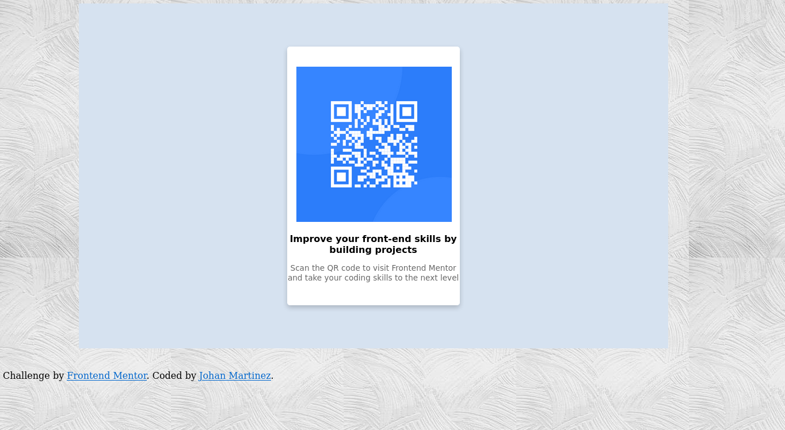

# Frontend Mentor - QR code component solution

This is a solution to the [QR code component challenge on Frontend Mentor](https://www.frontendmentor.io/challenges/qr-code-component-iux_sIO_H). Frontend Mentor challenges help you improve your coding skills by building realistic projects.

## Table of contents

- [Overview](#overview)
  - [Screenshot](#screenshot)
  - [Links](#links)
- [My process](#my-process)
  - [Built with](#built-with)
  - [What I learned](#what-i-learned)
  - [Continued development](#continued-development)
  - [Useful resources](#useful-resources)
- [Author](#author)
- [Acknowledgments](#acknowledgments)

**Note: Delete this note and update the table of contents based on what sections you keep.**

## Overview

This was an excelent exercise, it's been a while since I put in practice my knowledge wiht HTML & CSS, and it's amazin!
So far so good.

### Screenshot

### Links

- Solution URL: [Add solution URL here](https://your-solution-url.com)
- Live Site URL: [Add live site URL here](https://your-live-site-url.com)

## My process

First of all I started doing the HTML process creating a div and a container where I'll put all the class and ID's to make everything on CSS style.

### Built with

- Semantic HTML5 markup
- CSS custom properties

### What I learned

I learned how to make efficient ways to call classes from HTLM standing on CSS.
Also to use more Google when is needed

### Continued development

I think the most important thing here is put all knowledge together and start making thing, So starting implement other tools as react, etc.

### Useful resources

All useful things are in Google and StackOverflow

## Author

- LinkedIn - [Johan Martinez](https://www.linkedin.com/in/johanmartinezfx/)
- Frontend Mentor - [@yourusername](https://www.frontendmentor.io/profile/yourusername)

## Acknowledgments

I want to add some credit to (/Thecodercoder) Youtube channel who inspired me to get into action instead on keep watching tutorials my whole life XD.
